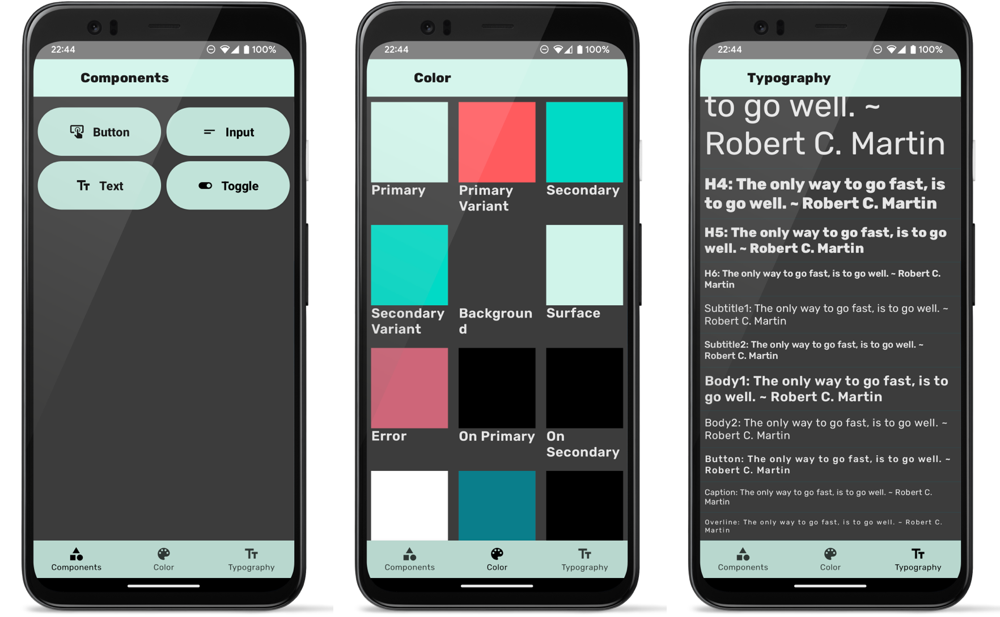

# Curiosity 🤓

[](https://github.com/HelloCuriosity/curiosity/actions)
[](https://codecov.io/gh/HelloCuriosity/curiosity)
[](LICENSE)
[](CODE_OF_CONDUCT.md)

Curiosity is a design system library _just for fun_, my rendition of building a _compose-able_ design system. You can
check out the demo app [Curiosity](https://play.google.com/store/apps/details?id=com.hello.curiosity.design) on Google
Play or build it from source here 🧑‍💻 This project is split into multiple libraries:

### Curiosity

Curiosity holds the UI components, which are split into different categories:

* Buttons
* Inputs
* Text
* Toggles

### Navigation

Navigation holds navigation components. BottomNavigation and scenes that make it easier to create uniformed scenes.

### Settings

Settings is a collection of setting specific UI components to speed up building settings screens.

### Test-Utils

Test-Utils is a collection of test utilities to help test compose UIs.

## Screenshots



## Getting Started

Curiosity is currently published to github packages. You will need to generate a PAT.

Add dependency:

```kotlin
dependencies {
    implementation("io.github.hellocuriosity:curiosity:0.11.1") // component library
    implementation("io.github.hellocuriosity:navigation:0.11.1") // navigation library
    implementation("io.github.hellocuriosity:settings:0.11.1") // settings library
    testImplementation("io.github.hellocuriosity:test-utils:0.11.1") // testing library
}
```

## Apps Using Curiosity

In addition to [Curiosity](https://play.google.com/store/apps/details?id=com.hello.curiosity.design) you can find a list
of apps using the curiosity design system.

| App                                                                                         | Description                                                 | Uses |
|---------------------------------------------------------------------------------------------|-------------------------------------------------------------|------|
| [Signore Sorriso](https://play.google.com/store/apps/details?id=com.hello.curiosity.jokes)  | Signore Sorriso is full of fun jokes for the whole family. | &bull; Curiosity<br/>&bull; Navigation<br/>&bull; Settings<br/>&bull; Test-Utils                                            |
